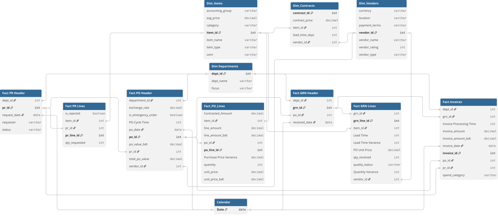

# 📊 Project Background: Procurement Spend Analytics at BanglaBazaar

BanglaBazaar.com is a leading e-commerce enterprise in Bangladesh, operating at the forefront of the nation's digital retail revolution. Since its inception, the company has scaled to manage a massive logistical footprint, serving millions of customers. As the organization prepares for a potential IPO, the **Procurement & Supply Chain** function has transitioned from a support role into a high-stakes capital allocation engine.

This project focuses on **Source-to-Pay (S2P) Intelligence**—moving beyond simple invoice tracking to diagnose "Process Paralysis" and "Value Leakage" across the supply chain. With an annual Total Cost of Ownership (TCO) of **39.3 Billion BDT**, any inefficiency in the purchasing cycle directly impacts the company's bottom line. This analysis serves as a strategic roadmap for the Executive Leadership Team to transition from a reactive, high-cost model to a **Strategic Sourcing** powerhouse.

Insights and recommendations are provided on the following key areas:

* **Process Paralysis & Maverick Spend** (Diagnosing the 8-Month Cycle)
* **The Payment Paradox** (Leveraging Terms against Performance)
* **The "Unreliability Tax"** (Inventory Hoarding & Working Capital)
* **Price Variance & Commercial Leakage** (Managed vs. Unmanaged Spend)

https://github.com/user-attachments/assets/b2fe4367-6d76-445b-a165-d265c551c312

**PowerQuery M Code regarding data preparation process ovarious tables f can be found [[here]](https://github.com/mehedibhai101/Procurement_Spend_Analytics/tree/main/Data%20Cleaning).**

**DAX queries regarding various analytical calculations can be found [[here]](https://github.com/mehedibhai101/Procurement_Spend_Analytics/tree/main/DAX%20Calculations).**

**An interactive Power BI dashboard used to report and explore sales trends can be found [[here]](https://app.powerbi.com/view?r=eyJrIjoiMzk2NzMwY2QtN2JkMi00YTVmLWI2MGQtODc3Yzk5Yjg0OTA5IiwidCI6IjAwMGY1Mjk5LWU2YTUtNDYxNi1hNTI4LWJjZTNlNGUyYjk4ZCIsImMiOjEwfQ%3D%3D).**

---

# 🏗️ Data Structure & Initial Checks

The procurement analytics data warehouse is structured as a Star Schema, integrating the entire lifecycle of a purchase—from the initial request to the final bank settlement.

* **`fact_pr_lines` / `fact_po_lines`:** Tracks the requisition-to-order flow, identifying bottlenecks in the approval chain.
* **`fact_grn_lines`:** Records goods receipt quality and timelines, used to calculate **On-Time-In-Full (OTIF)** delivery.
* **`fact_invoices`:** Financial records categorized by spend type (Inventory, Capex, Opex) to monitor cash outflows.
* **`dim_vendors` & `dim_contracts`:** Profiles 150+ partners and their negotiated rates vs. actual invoiced amounts.

### 🗺️ Procurement Data Warehouse Schema


---

# 📋 Executive Summary

### Overview of Findings

BanglaBazaar is currently **"Funding Inefficiency."** While TCO has surged by **86.6%**, procurement volume only grew by **63.3%**, indicating significant price leakage. The root cause is an alarming **246.5-day PO Cycle Time**, which has broken the formal procurement process and forced departments into **18.73% Maverick Spend** (unauthorized buying). Strategically, we have surrendered our leverage by paying invoices in **~3 days** (financing the vendor) while accepting a dangerous **57.93% OTIF** reliability rate. This unreliability has forced the company to hoard **62% of its spend in Inventory** as a defensive "Safety Stock" measure.

---

# 🔍 Insights Deep Dive

### ⏳ Process Paralysis & Maverick Spend

* **The Approval Bottleneck.** The 246.5-day cycle from request to order is the primary driver of non-compliance. Departments simply cannot wait 8 months for essential items, leading to "emergency" off-contract buying.
* **IT & Tech "Going Rogue."** **44% of Maverick Spend** is concentrated in the IT & Technology department. This lack of centralized control is a major contributor to our overall **18.73% maverick rate**.
* **Approval Friction.** Data suggests that 70% of the delay occurs between "Request Approved" and "PO Released," signaling a breakdown in the purchasing department’s execution speed.


### 💸 The Payment Paradox & Leverage Gap

* **Financing Underperformance.** We process invoices in an average of **2.98 days**, yet our vendors only deliver on time **57.93% of the time**. We are rewarding poor service with immediate liquidity.
* **Vendor Risk Profile.** High-monetary risk vendors like **Galvan-Jackson Ltd** (Rating: 1.82) are being paid as quickly as top-tier partners, removing any incentive for them to improve their delivery reliability.
* **Lost Cash Flow.** By paying in 3 days instead of a standard Net-30, the company is sacrificing significant interest-earning potential on its cash reserves.


### 📦 The "Unreliability Tax" (Inventory Hoarding)

* **Defensive Overstocking.** **62.2% of total spend** is locked in Inventory. This high concentration is not a strategic buffer but a reaction to the low 57% OTIF rate.
* **Capital Opportunity.** Improving vendor reliability to 85% OTIF would allow the organization to reduce inventory levels by 15%, potentially freeing up **5.9 Billion BDT** in working capital.
* **Storage Costs.** The excess "Safety Stock" is driving up warehousing and facilities costs, which have increased by 21% YoY.


### 📉 Price Variance & Commercial Leakage

* **The "Urgency Premium."** Off-contract buying has resulted in a **+8.43% Price Variance**. For common items like IT peripherals, we are paying 15-18% more than our negotiated rates.
* **Managed vs. Unmanaged Spend.** Only **81% of spend** is formally "Managed." The remaining 19% "Unmanaged" spend is where the majority of margin erosion occurs.
* **Tail Spend Management.** 70% of our vendors represent only 5% of our spend but consume 40% of the procurement team's administrative bandwidth.


---

# 🚀 Recommendations:

Based on the analysis, the following strategic pillars are recommended for the upcoming fiscal year:

* **Red Tape Compression:** Immediately audit the approval chain to reduce the PO Cycle Time from 246 days to **under 30 days**. Speed is the only cure for Maverick Spend.
* **Strategic Payment Terms:** Move all non-critical vendors to **Net-30 or Net-45 terms**. Reserve "Fast Payment" (3-day) only as a reward for partners achieving **>95% OTIF**.
* **Digital IT Catalogs:** Implement pre-approved digital catalogs for high-volatility IT hardware. Lock in annual fixed rates to eliminate the **18% price variance** and rogue buying.
* **Vendor Rationalization:** Phase out "Risky Vendors" (Rating <3.0) and consolidate volume with high-performers like **Hull-Smith Traders** (Rating 4.05) to increase volume-based discounts.
* **Transition to JIT:** Once OTIF reliability improves, transition Inventory management toward **Just-In-Time (JIT)** principles to liquefy tied-up capital for IPO expansion.

---

## ⚠️ Assumptions and Caveats:

* **Unauthorized Spend Logic:** Maverick Spend was identified by transactions with no linked `contract_id` or a price variance of >5% from the master contract.
* **Purchase Cycle Time:** PO Cycle Time includes all approval steps from the initial PR `request_date` to the final PO `Released` status.

---

## 📂 Repository Structure

```
Advanced_End-to-End_Retial_Analytics/
│
├── Dashboard/                            # Final visualization and reporting outputs
│   ├── assets/                           # Visual elements used in reports (logos, icons, etc.)
│   │   ├── Icons/                        # Collection of icons used in KPI Cards/Buttons
│   │   └── Theme.json                    # Custom Power BI color palette for dashboard
│   ├── live_dashboard.md                 # Links to hosted Power BI Service report
│   └── static_overview.pdf               # Exported PDF version of the final dashboard for quick viewing
│
├── Data Cleaning/                        # Power Query M Codes for cleaning tables of the dataset.
│
├── Dataset/                               # The data foundation of the project
│   ├── entity_relationship_diagram.svg    # Visual map of table connections and cardinality
│   ├── dim_contracts.csv                  # Agreed pricing and lead-time benchmarks
│   ├── dim_departments.csv                # Cost center mapping for NYC store locations
│   ├── dim_items.csv                      # Master catalog of supplies and inventory types
│   ├── dim_vendors.csv                    # Supplier profiles and performance ratings
│   ├── fact_grn_header.csv                # Delivery logs and receiving timestamps
│   ├── fact_grn_lines.csv                 # Audit trail for quantity and quality variances
│   ├── fact_invoices.csv                  # Payment records and processing cycle times
│   ├── fact_po_header.csv                 # Official $4.25M spend and order metadata
│   ├── fact_po_lines.csv                  # Granular spend data to track price leakage
│   ├── fact_pr_header.csv                 # Internal demand and request status logs
│   └── fact_pr_lines.csv                  # Line-item requests to find approval bottlenecks
│
├── DAX Calculations/                     # Business logic and analytical formulas
│   ├── calculated_column.md              # Definitions for static row-level logic (e.g., hour buckets)
│   └── measures.md                       # Dynamic aggregation formulas (e.g., Total Revenue, MoM Growth)
│
├── LICENSE                               # Legal terms for code and data usage
└── README.md                             # Project background, summary and key insights
``` 

---

## 🛡️ License

This project is licensed under the [MIT License](LICENSE). You are free to use, modify, and distribute it with proper attribution.

---

## 🌟 About Me

Hi! I’m **Mehedi Hasan**, well known as **Mehedi Bhai**, a Certified Data Analyst with strong proficiency in *Excel*, *Power BI*, and *SQL*. I specialize in data visualization, transforming raw data into clear, meaningful insights that help businesses make impactful data-driven decisions.

Let’s connect:

[](https://www.linkedin.com/in/mehedi-hasan-b3370130a/)
[](https://youtube.com/@mehedibro101?si=huk7eZ05dOwHTs1-)
